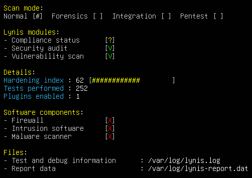
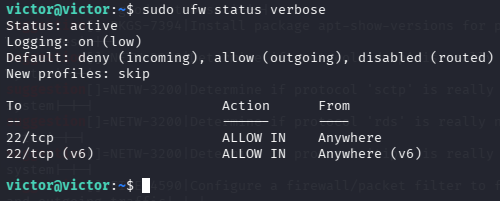
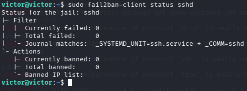
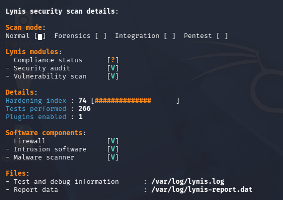

# Ubuntu Server Hardening with Lynis

System hardening process applied to a freshly installed Ubuntu Server 22.04 LTS instance. Starting from a default configuration, security weaknesses were identified using Lynis, a prioritised set of measures was applied, and the results were verified through repeated, quantifiable audits.

This project takes a defensive approach, complementing the offensive methodology demonstrated in the [Metasploitable 2 penetration testing lab](https://github.com/victorborrero01/pentesting-lab-metasploitable2).

---

## Environment

| Parameter | Value |
|-----------|-------|
| Target system | Ubuntu Server 22.04 LTS (Jammy Jellyfish) |
| Hypervisor | VMware Workstation Pro |
| Network | NAT |
| RAM / vCPU | 2 GB / 2 cores |
| Remote access | OpenSSH Server |

---

## Tools Used

| Tool | Purpose |
|------|---------|
| Lynis 3.1.6 | Security auditing and hardening benchmark |
| UFW | Firewall management (iptables frontend) |
| Fail2ban | Brute-force protection for SSH |
| Rkhunter | Rootkit and malware detection |
| Auditd | Kernel-level security event auditing |
| AIDE | File integrity monitoring |

---

## Methodology

1. **Baseline audit** — Initial Lynis scan to establish a starting Hardening Index and list of suggestions
2. **Prioritisation** — Suggestions grouped by risk impact; low-impact or infrastructure-dependent items explicitly deferred with justification
3. **Remediation** — Nine security measures applied, covering network filtering, authentication, boot security, and threat detection
4. **Verification** — Two subsequent Lynis audits to measure the quantifiable impact of the applied measures

---

## Applied Measures

| # | Measure | Lynis ID(s) |
|---|---------|-------------|
| 1 | Firewall (UFW), default-deny policy | FIRE-4590 |
| 2 | Fail2ban for SSH brute-force protection | DEB-0880 |
| 3 | Password policy (length, complexity, expiry) | AUTH-9230, AUTH-9262, AUTH-9286 |
| 4 | GRUB bootloader password | BOOT-5122 |
| 5 | Legal warning banner (local + SSH) | BANN-7126, BANN-7130 |
| 6 | Rootkit/malware scanner (rkhunter) | HRDN-7230 |
| 7 | SSH root login disabled | — |
| 8 | Audit framework (auditd) | ACCT-9628 |
| 9 | File integrity monitoring (AIDE) | FINT-4350 |

---

## Key Result

**Hardening Index: 62 → 74 (+19%)** across three audit cycles.

| Metric | Audit 1 (Baseline) | Audit 2 | Audit 3 (Final) |
|--------|---------------------|---------|------------------|
| Hardening Index | 62 / 100 | 72 / 100 | 74 / 100 |
| Firewall | Absent | Active | Active |
| Intrusion software | Absent | Active | Active |
| Malware scanner | Absent | Active | Active |

---

## Evidence

### Baseline Lynis audit (Hardening Index: 62/100)

### Firewall active with default-deny policy

### Fail2ban monitoring SSH authentication

### Final Lynis audit (Hardening Index: 74/100)

---

## Full Report

The complete hardening report (all nine measures with commands, rationale, and full evidence set) is available as a PDF:

📄 [hardening_report.pdf](report/hardening_report.pdf)

---

## Disclaimer

This project was conducted in a fully isolated lab environment for educational purposes only. All systems are virtual machines configured specifically for security practice.

---

## About

**Víctor Borrero** — 4th year Computer Engineering student at Universidad de Huelva, specializing in Networks and Cybersecurity. Holder of all three CCNA v7 certifications.

victorba0201@gmail.com
